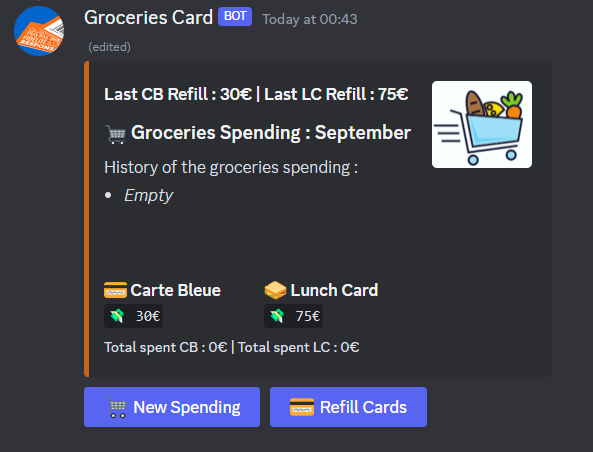

<p align="center">
  <a href="https://bun.sh"></a>
</p>
<h1 align="center">Groceries Cards Management Bot </h1>

This bot is a simple discord bot in order to easily manage my groceries budget for each month. With this bot, I can easily setup an amount for my credit card and lunch card, and then follow what I've spent on each card, with a complete history of each month.



### Tech' Context


This project was also meant to discover Bun. Bun fits perfectly for this project, as a quick, simple bot, enjoying the built-in TypeScript support and also the dotenv one and even more, the sqlite3 support. <br>

> SQLite that I've never used before, but also perfect for a light and simple project like this one.

## Table of Contents

- [Tech' Context](#tech-context)
- [Table of Contents](#table-of-contents)
- [How to use it](#how-to-use-it)
  - [Technologies](#technologies)
  - [Setup](#setup)
  - [Database](#database)

## How to use it

### Technologies

| Name       | Version |
| ---------- | ------- |
| Bun        | 1.0.2   |
| TypeScript | 5.2.2   |
| SQLite     | 3.43.1  |

### Setup

1. Install Bun globally

```bash
# For Mac, Linux, WSL
curl -fsSL https://bun.sh/install | bash

# For Windows
# Still under development
```

2. Clone the repository

```bash
git clone https://github.com/Eric-Philippe/Groceries-Cards-Managemet.git
```

3. Install dependencies

```bash
bun i
```

4. Create a `.env` file at the root of the project and fill it with the following variables following the `.env.example` file

```bash
nano .env
| DISCORD_TOKEN=<YOUR_TOKEN>
| CLIENT_ID=<YOUR_CLIENT_ID>
| GUILD_ID=<YOUR_GUILD_ID>
```

5. Run the bot

```bash
bun start
# or
bun start & # to run it in background
```

### Database

As previously stated, this bot uses SQLite. I've left the artefact file `mydb.sqlite` with all the tables and cards created in the repository, but you can delete it and run the bot, it will create a new one. The schema file is in the `src/database/create_tables.ts` file.
In order to launch it, just do as follow:

```bash
bun run src/database/create_tables.ts

> Table cards created successfully
> Table history created successfully
> Default values inserted successfully
```
